# Reversible Computation and Delta Oriented Programming

Many years ago, in order to report to the leaders, I needed to advocate the originality and universality of reversible computing theory, so I did a little literature research and consulted the articles of the International Conference on Software Engineering (ICSE) over the years. The closest theory found was Feature Oriented, which emerged in 1997. Programming (FOP)  [ [2] (# F2)  [ [3] (# F3)  and Delta-Oriented proposed by Professor Schaefer in Germany around 2010 Programming（DOP） [[7]](#f7) [[8]](#f8)。 The theory of reversible computation was proposed  by me around 2007 [ [12]] (# F12)
[ [13] (# f13)  [ [14] (# f14) , its source of thought is not the traditional software engineering or computer field, in fact, my academic background is theoretical physics, and I do not know the historical achievements of software engineering theory in advance. Therefore, at the level of basic principles, reversible computation is not the same as the existing theory in academia. In this article, I briefly introduce the differences and connections between the theory of reversible computation and similar theories.

## One. Software Product Line Engineering and Variability Management

When it comes to software engineering theory, the Software Engineering Institute (SEI) of Carnegie Mellon University is indispensable. It is not only the leader of the theoretical circle, but also a model of integrating theory with practice (the annual CMM certification authorization fee is soft). Since The so-called software product line engineering theory (Software Product Lines)  [ [1]] (# F1)  was put forward by SEI, many theories in academia have undergone a process of calibration and adjustment. Calibrate your own concepts to the discourse system of the software product line. Software product line engineering is a comprehensive theory across the management and technical fields, trying to use all feasible means to solve very large system-level and product-level software reuse problems (far beyond the fine-grained component reuse technology).

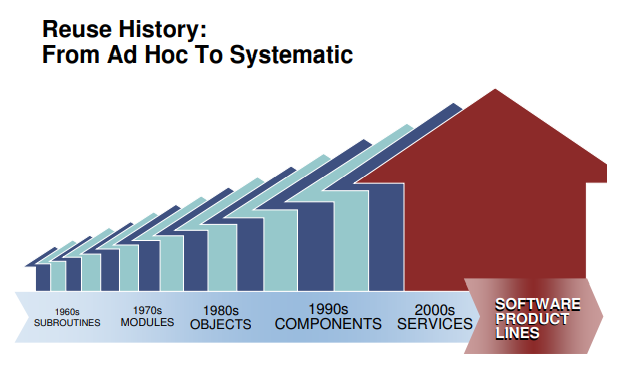

The core technical problem raised by software product line engineering is the so-called ** Variability management **. This is almost a universal basket-type problem. What we encounter ** Almost all difficulties can easily be attributed to a lack of ability to cope with change. ** in software development and evolution. After calibration, FOP positions itself as a natural and efficient implementation path for software product lines. Later, DOP interpreted itself as an improvement of FOP defects, which is also a key technical means to achieve variability management. Following the same calibration logic, reversible computing can be seen as a further development and promotion of DOP. Of course, the reality is that reversible computing predates DOP, and it follows a completely different line of thought.

According to theoretical analysis, the real difficulty of variability management lies in how to effectively control ** Unexpected ** unexpected changes. If we are very familiar with a domain, and there are a limited number of ways to change in the domain, then we can set up a few ** Just the right extension point ** key locations to solve the problem of variability. But if the number of possible locations for change increases, and the ways in which change occurs change in new ways (in other words ** The freedom of change increases until it reaches infinity. **), then sooner or later the freedom of change will go beyond what can be controlled by manual enumeration. How can we effectively describe and control the infinite number of degrees of freedom of change in this unknown evolutionary scenario? In physics, this is actually a problem that has already been solved.

The Newtonian physics we learned in high school is the so-called rigid body mechanics in classical mechanics. Its worldview is completely mechanical: the motion of a rigid body is completely described by a few parameters such as its center of mass coordinates and size, shape, and orientation. It doesn't matter that the internal structure of the rigid body cannot be observed. The rigid bodies interact with each other through direct contact, and the shapes of the rigid bodies must be precisely matched to form a seamless whole (compare the black-box model of software components). Even in classical mechanics, a slightly more advanced point of view will be converted to Lagrangian or Hamiltonian formulation, whose spiritual essence is turning ** The world view of field theory **. The so-called Field is actually ** An omnipresent coordinate system is established, and then a physical quantity can be specified at each point of the coordinate system. **. The degree of freedom of the field is infinite, but it can be described, defined and studied through the coordinate system, and we can accurately measure the local changes at each point of the coordinate system. Based on the same spirit, the basic setting of reversible computing is to first establish a sufficiently fine and general domain description coordinate system, in which we can point to where to hit where and hit where to point (** Uniqueness of coordinates **). After establishing the concept of field, we can make some theoretical analysis of FOP and DOP in the next section.

## Two. From Feature Oriented Programming (FOP) to Difference Oriented Programming (DOP)

Feature-oriented programming, as its name implies, its core concept is the so-called Feature. So, what is a feature? As  defined in [ [3]] (# F3) 

> A feature is a unit of functionality of a software system that satisfies a requirement, represents a design decision, and provides a potential configuration option.

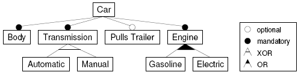

For example, according to the above feature model, the Car must have the feature of Engine, which can be fuel or electric, or even hybrid. Transmission can be automatic or manual, but not both. According to the assumption of software product line engineering, specific software development is similar to checking in the configuration menu when buying a car (it can also be analogous to ordering in a restaurant). After selecting the specified features, the generator is responsible for converting them into executable code and automatically generating a runnable program.

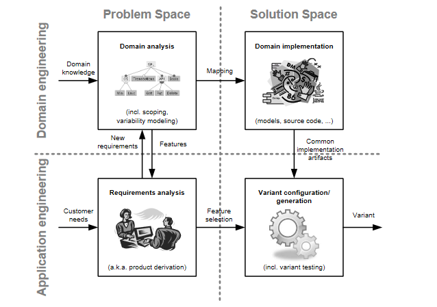

The fundamental insight of FOP is that features (what we care about at the business level) often do not align well with object-oriented (component) or functional decomposition structures, and are almost certainly a crosscutting concern. This is also easy to understand. A feature is a valuable and identifiable structure in the problem space, while a component/function is an effective abstraction and description in the solution space. The structure mapping from the problem space to the solution space is ** Nontrivial ** in the general business environment, so the two descriptions cannot be effectively aligned. To paraphrase the field of artificial intelligence, we can say: ** Useful features are distributed. **.

In software product line engineering, a basic technical means to implement feature definition and composition is a preprocessing mechanism (conditional compilation) similar to C language.

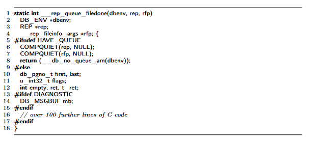

The contribution of FOP to software product line engineering is that it provides a more formal and powerful mechanism  for feature definition and composition [ [5] (# F5)  [ [6] (# F6) .

1. Define a language-independent Feature Structure Tree (FST)
2. Feature composition is implemented through language-independent Tree Superimposition.

The so-called FST is a general tree structure, each node has a name (name) and a type (type), and the names of the child nodes are different, so that they can be distinguished. Tree Superimposition is the merging process between two trees. The nodes are merged level by level according to their names, and the types of the merged nodes need to be matched.

> Superimposition is the process of composing software artifacts by merging their corresponding substructures.

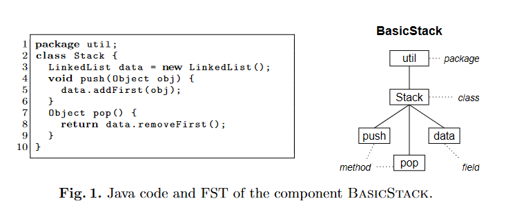

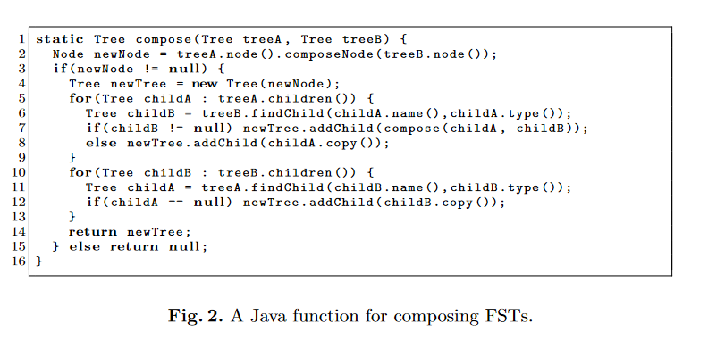

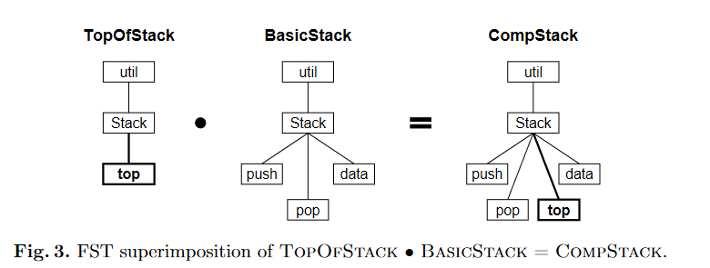

The early FOP did not realize the generality of the tree structure and the tree structure merging algorithm, and it used the way to extend the syntax of the existing language.

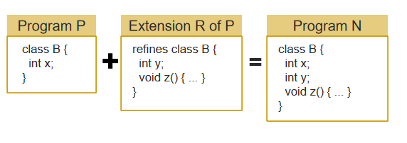

A series of works  published by Apel around 2008 – 2009 [ [4] (# F4)  [ [5] (# F5)  [ [6]) (# F6)  pushed FOP to a new level of abstraction. Not just code files, but documentation, test cases, and all related artifacts can be brought under the purview of the feature structure tree. FeatureHouse  [ [6]] (# F6)  allows the introduction of generic merge rules for any syntax structure by adding FOP-related annotations to EBNF syntax rules (eliminating the need to introduce specific programming languages for FOP). Thereby greatly expanding the application range of the FOP.

> FEATUREHOUSE relies  on  three  ingredients:
>
>  (1) a  language-independent  model  of  software  artifacts
>
>  (2) superimposition  as  a  language-independent  composition paradigm
>
>  (3)  an artifact language specification based on attribute grammars.

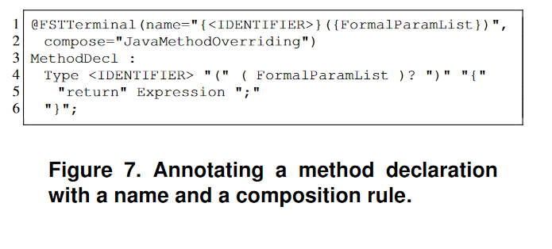

According to the analysis of the previous section, this series of practices of FOP is actually very easy to understand. The so-called FST tree is a general description coordinate system, and all artifacts ** Inevitably ** can be decomposed into this coordinate system to obtain a unique and definite representation. The reason why it is a tree structure is that in the ** The path from any node to the root node is unique ** tree structure, it can be used as a coordinate. After the coordinates are determined, the merging process on the coordinate points is completely Generic and has nothing to do with the specific business logic and business structure. This is clearly expressed in the Feature Algebra formal algebra  [ [4]] (# F4)  introduced by Apel.

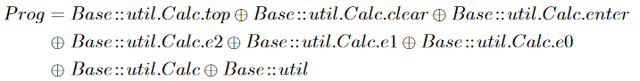

If we make a comparison with AOP, we can find a very interesting situation. The pointcut capability of AOP is very powerful, and it can directly use complex operators such as regular expressions to achieve filter selection, but it loses the uniqueness of coordinates and is difficult to establish Feature Algebra. At the same time, AOP is deeply bound to the programming language, and it is difficult to extend to other artifact levels. Therefore ** Strong expression ability is not all we need to pursue. **, reversible computing emphasizes reversibility very much, and behaviors that are so powerful that they destroy reversibility need to be restricted or even prohibited.

The theory of FOP seems to be very perfect, but from the perspective of reversible computing, it still has a lot of room for development. In 2010, Schaefer found a shortcoming of FOP and proposed the so-called Delta Oriented Programming. Schaefer's findings are

> It is not possible to start from an existing legacy application comprising a larger set of features and to ** remove **  features.

If so ** Abandon all business interpretations of a feature and define it directly as a Delta of the feature. **, you can immediately see that FOP only contains overwrite and add operations, and no operations are defined ** Delete **! DOP originally introduced a Java-like syntax: DeltaJ  [ [10]] (# F10)

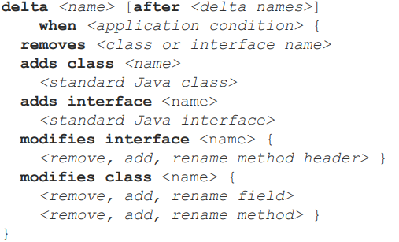

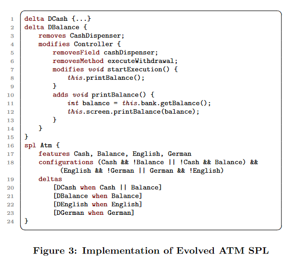

Later, DOP also learned FeatureHouse and introduced DeltaEcore  [ [11]] (# F11) , which can introduce a differential structure for any grammar.

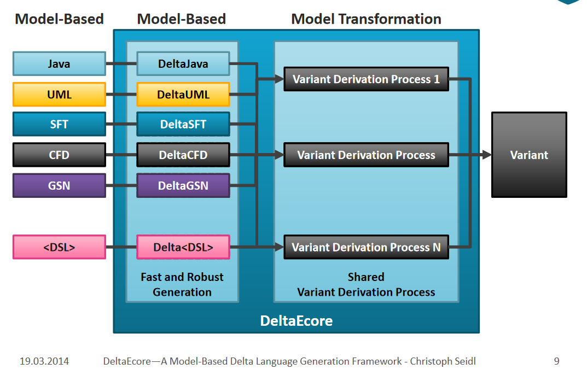

In the earliest days, DOP needed to contain a core product, and all deltas were applied to the core product to produce the final product. However, according to the theory of reversible computation, in the presence of a unit element, the difference and the total can be transformed into each other. Schaefer quickly discovered this, and immediately published a paper  [ [8]] (# F8) , pointing out that all systems can be built by relying solely on delta modules without a core product.

Looking at DOP from the perspective of reversible computing, we will find that it still has a lot of room for development, the most obvious is that it lacks the Generator part. However, compared with reversible computing, DOP's understanding of Delta is still at a relatively elementary level. Two days ago, taowen mentioned a paper  [ [15]] (# F15) , which describes a technology related to difference quantity, XVCL, which also has some similarities with DOP. In the next section I will examine the differences between the concept of differentials in reversible computation and techniques such as DOP and XVCL.

## Three. XVCL and Frame Technology

XVCL claims that its theoretical basis comes from the so-called Frame technology, and Frame technology claims that its concept comes from the Frame in the field of artificial intelligence, which was invented by Minsky in 1975. In order to publish a paper, everyone has to find a decent grandfather for his concept. Simply put, a Frame is an architype in which holes are dug, called slots, which can be customized, basically not much different from vue components.

> 1. Select an example X
> 2. Mark the details of the X interior that are subject to change, turn it into a frame parameter (slot), and make the original contents of example X the default (body of slot) (..). Well, this is a vue component)

There is a 2008 interview  with Frame technology inventor Bassett [ [17]] (# f17)  on the Internet, which contains some interesting ideas (basically the ideas I expressed based on the theory of reversible computing, which is great minds think alike. Or is history a loop?) ：

1. Frame can effectively describe the case "A is very similar to B, ** Besides **..", and also the case "A is very similar to B + C, ** Besides **.."
2. Programmers modify the code by copying and pasting, which is labor-intensive and unreliable, and add, delete and modify the code by frame instruction, which is fast and accurate.
3. Frames can be nested with each other to form a Frame Tree, which can be built on the structure expressed by any language (for example, adding a frame tag to a text document written in a natural language can realize the frame extension of the document).
4. From Frame's point of view, maintenance is no longer a separate process from development. The whole development process is the same as the maintenance process, which is realized by gradually increasing the frame difference externally (the original frame does not need to be modified, and only the tag needs to be added in the original frame).
5.  Similar programs often differ by small amounts of code, ** The difference part can be localized in the frame delta. ** generally only 5% -15% of the total
6. There is something called natural graininess in any field. Concrete implementation techniques, such as classes and functions, can fragment the natural structure (for example, hundreds of small classes and functions), resulting in unnecessary complexity.
7. Frame is based on a semi-lattice mathematical structure and can handle multiple inheritance problems (similar to the trait mechanism of scala language, it avoids conceptual conflicts caused by inheritance by specifying the order of coverage).
8. Frame is an architype, which can be seen as the central element of a fuzzy set. Unlike other abstraction techniques, ** There is no need to ensure that the abstraction of the frame is correct in advance. **. If you find that you still need to add a change point, just add the slot tag to the original frame (fully compatible with the previous code, without any runtime cost).

The above idea sounds magical, but the corresponding XVCL implementation code is unpretentious.

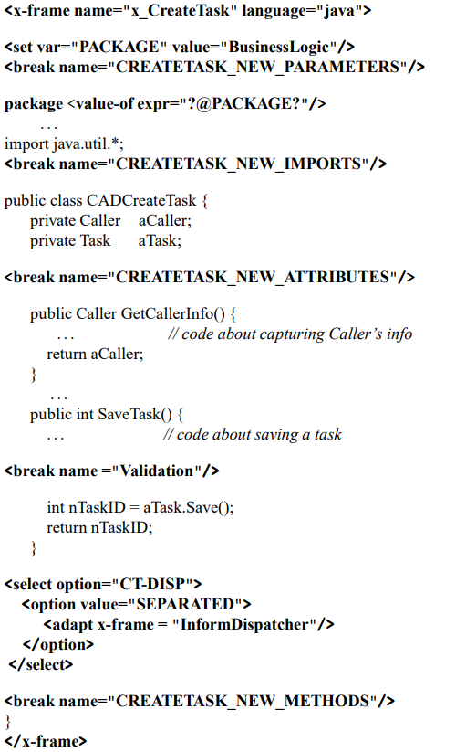

XVCL is similar to a template language where variables, judgments, loops, etc. Can be defined. An adapt is similar to a function call and can nest calls to other frames. The break tag is used to mark an extension point, similar to the slot tag in vue. Because it is similar to a template language, it can be used to generate code as well as documentation. Such as generating a Use Case document.

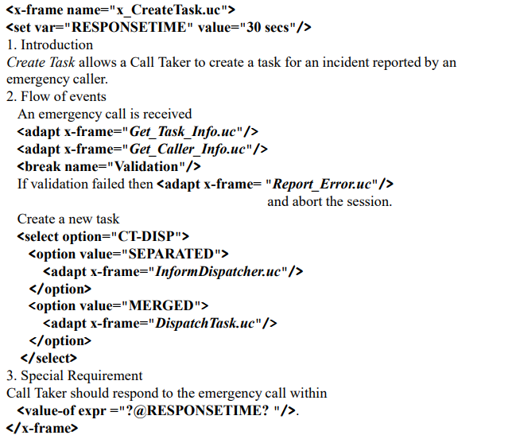

XVCL is different from the vue component after all, and it provides some kind of differential programming capability: when other frames are called through the adapt tag, You can use insert-before/insert/insert-after to perform more complex control on the customized content (when adapting, the part corresponding to the insert tag will modify the part marked by the break tag in the basic frame). The effect of deleting the default content can also be achieved by using insert empty.

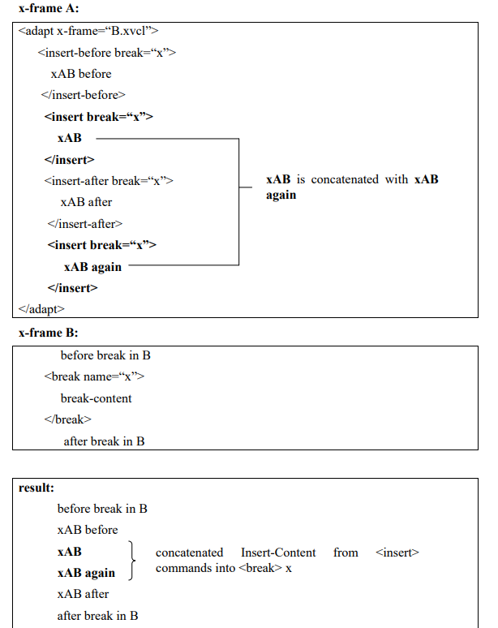

XVCL is an improvement over the C preprocessor because it ** Can be applied to files in any text format ** is not limited to specific programming languages (although any template language can do this), has stricter variable scoping rules, and provides slot customization capabilities that the ** Controlled delta customization mechanism ** C preprocessor cannot provide.

However, according to the analysis framework of reversible computing theory, the coordinate system established by XVCL is actually weaker than FeatureHouse  [ [6]] (# F6) : A break tag is added to the frame to construct a coordinate system that can be used to support customization. However, the frame files are basically in an unorganized state. FeatureHouse manages all artifacts according to the directory structure and defines a merge operator on each level of directory. The frame-break two-level abstraction is basically similar to the class-member structure, and the FeatureHouse can simulate the frame mechanism without pressure through the Feature Structure Tree. DOP also provides more feature composition capabilities than XVCL.

Although FOP, DOP and Frame Technology all use the concept of difference, the difference they define is obviously different from the difference in reversible computation theory: reversible computation points out that difference is not only to express difference, but more importantly, it means reversible operation structure, which can effectively limit the entropy increase of the system. When designing based on reversible computation, the introduction of any mechanism requires a paired design (forward and backward). In the next section, I will explain in more detail the differences in reversible computation.

## Four. What is different about reversible computing?

In the introductory article  of reversible computation [ [18]] (# F18) , I first formulated a heuristic idea: reversible computation can be seen as ** The third logical way to realize so-called Turing-complete universal computation beyond Turing machine theory and Lambda calculus theory **. The purpose of emphasizing this idea is to point out that ** Reversible computing is not a simple programming technique or a domain-specific design pattern. ** it is a universal computing structure, which can be used in various abstract levels and application fields. Reversible computation is closely related to the concept of entropy in physics, and the laws it reveals are not limited to software application systems.

Reversible computation introduces the core concept of reversible difference, which clearly States ** Total = Unit + Differential ** that ** Total quantity and differential quantity can be transformed into each other. **. A basic corollary of this concept is: ** Total and differential quantities can be isomorphic and should be constrained by the same schema **. This is very different from DOP and XVCL. In both DOP and XVCL, the difference is ** In the form of a modified action ** expressed in a completely different way from the full amount. In this case, how to describe the difference of the difference? In the case that the difference is isomorphic to the total, ** The differential of the differential is still an ordinary differential. **. Many people regard the role of differential as base + patch, thinking that base is primary and patch is secondary. However, in fact, base can also be regarded as the patch of patch, and the relationship between base and patch is dual, so there is no need to treat them differently in theory. ** Difference has independent value, and it does not need to be attached to the base to be understood. **。

In XVCL, we need to proactively insert a break tag in the code to mark the extension point. But the universality of reversible computation dictates the following fact: ** The DSL model is both an entity defined in a coordinate system, and it constitutes the coordinate system itself **. We do not need to add additional description information in the model for the extension point alone, but only need to add a small amount of annotation information in the EBNF rule/Schema definition similar to FeatureHouse.

In FOP, the feature model is very high-level, which is basically degenerated into a switch tree, and it is difficult to accommodate complex domain logic, while the specific feature expression means is very low-level, which is generally similar to the syntax of the general programming language, or directly attached to the general programming language (such as Java). As a result, the process of compiling specific products according to the combination of features is bound to a lot of detailed knowledge, which is difficult to extend to complex application scenarios. This can be seen from the fact that most of the examples cited in the FOP paper are toy projects. Reversible computation clarifies the core position of DSL and points out the direction for the gradual introduction of domain knowledge.

1. ** How to integrate DSL and DSL seamlessly **？ The intrinsic structure of DSL is described by Tree structure, but each node can have different presentation level text syntax, and can be associated with different visual interfaces. So different DSLs can be seamlessly nested together
2. ** How different DSLs can share some information to avoid logical conflicts **？ $DSL _ 2 = Generator \ langle DSL _ 1 \ rangle + Delta $, shared information can be reversely extracted from the DSL1 model and then propagated to the DSL2 model through the generator, and the non-shared part can be directly described through the Delta mechanism.

Although FOP introduces the generic tree structure of Feature Structure Tree, it is similar ** It is difficult to extricate oneself from the logical trap of type theory. ** to other mainstream practices in the industry. Type theory can be seen as providing a two-level coordinate system: any structure has a definite type, and we can locate the specified substructure according to the property name or method name (equivalent to a local relative coordinate). The customization process is also divided into two steps: 1. Find the corresponding object according to the type 2. Open the object and modify its properties or methods. But ** The use of types as a coordinate system is clearly imprecise and imperfect **..

As a coordinate system, the most basic capability is to provide the following two operations

1. value = get(path)
2. set(path, value)

All objects that need to be identified should have unique access coordinates in this coordinate system.

But the original meaning of type is to merge the same structure: ** Different objects have the same type **. This leads to the fact that using types to uniquely locate in domain space is not a matter of course. The most basic question is, how do you locate an element in an array whose elements have the same type? We can use array subscripts as local coordinates in the array, but ** This coordinate representation is generally unstable. **. When we insert an element into an array, the subscripts of all subsequent elements change accordingly. Looking at the implementation of the diff algorithm for the virtual DOM, we can see that it is necessary to specify a special ID attribute for each element in the array as a stable coordinate representation of that element. Of course, it is certainly possible to extend the type system to include this concept in type definitions, but if a model object always has only one instance, it is questionable how necessary it is to limit ourselves to the discussion of type theory.

The feature structure tree of FOP corresponds to the organizational hierarchy of package-class-method. When we need to specialize, it will inevitably lead to the introduction of a large number of unnecessary types. Reversible computation is organized according to the domain structure (the DSL model itself may correspond to multiple levels, rather than the two levels of class-method), and the uniqueness of coordinates is clearly defined in the domain structure, so the structure has a unique coordinate representation, and the generator is equivalent to a mapping function. It maps the coordinate representation of an object to a new coordinate representation (like the evolution of a physical system in phase space). The generator itself is also expressed in the same coordinate system, and its evolution can be driven by the same dynamic process. Compared with FOP, reversible computation is obviously more adaptable.

FOP and DOP are useful theoretical explorations of how to construct complex systems in academia, and they do bring me some new inspiration. Specifically, I incorporate the concept of feature selectors into reversible computation, allowing `feature:on='特性选择表达式'` this annotation to be used on any model node to decide whether or not to enable the relevant part of the feature. This process occurs before the model structure is resolved, so it is a completely general mechanism, independent of the specific DSL model.

## Five. Open source plan for reversible computing

Can insist to see here, it is estimated that there are few people, shake hands. If you are really interested in reversible computing, you may think that pure theory is not very interesting, so it is better to show me the code. This can have. I expect to open source a reference implementation ** Entropy Platform 2.0 ** of reversible computing by the end of this year, which is currently in the process of code consolidation (mainly code refactoring to highlight the theoretical concepts of reversible computing, but given the author's diligence, there is also a great possibility that it will bounce to the first half of next year). The backend uses Java (independent of the spring framework), the frontend uses vue 3.0, and the open source part of the first phase mainly includes all the technologies involved in the link from model definition to GraphQL service. The plan mainly shows the following contents:

1. Model-driven code generation: You only need to input a data model in Excel format to get a complete set of executable codes at the front and back ends, which can complete the addition, deletion, modification and query of the multi-primary-sub table data structure.

2. Incremental model enhancement: Incremental fine-tuning is possible based on the generated code. Manually adjusted code and automatically generated code are isolated from each other and do not affect each other.

3. Visual design based on homomorphic mapping: Code and visual model can be regarded as two homomorphic representations of the same logical structure, and the corresponding visual designer is automatically generated according to the meta-model definition.

4. Multi-version differential customization: Different implementation logic can be customized for different deployment versions without modifying the main program code. Customized code is stored in differential form, and the granularity can be accurate to a single function and a single button.

5. Co-evolution of the designer and the application: The designer itself is a model-driven product, and it is not a fixed tool. The designer can be customized and optimized for specific applications, and enhanced with the evolution of application functions. Designer customization logic is identical to application customization.

6. Compile-time metaprogramming: New models can be defined at any time through the metamodel, and corresponding parsers, validators, visual designers, etc. Are automatically obtained. A large amount of model construction and transformation work is completed at compile time, which greatly simplifies the runtime structure and can adapt the same model to multiple runtime engines.

7. Unification of GraphQL service, message service and batch processing service: without programming, the same business processing logic can be published as online GraphQL service, or message queue processing service, or batch file processing task, and automatically realize batch loading and batch submission optimization.

8. Model-driven automated testing: No need to write test codes. In the process of system debugging, you can automatically record service input and output data and database change records, and implement playback testing. The automated test engine will automatically identify information such as the randomly generated primary key and primary-sub table association, and execute the corresponding verification code.

9. Real-time update based on change detection: automatically identify model file changes and implement real-time recompilation. File changes are monitored by FileWatch to actively trigger recompilation.

10. Sub-database and sub-table, multi-tenant and distributed: built-in support for complex application scenarios.

In the future, we will gradually open source IDE plug-ins and runtime engines such as WorkflowEngine, RuleEngine, ReportEngine and JobEngine, integrate GraalVM virtual machine, implement XLang runtime based on Truffle framework, and support compiling into binary programs.

Project address: [https://gitee.com/canonical-entropy](https://gitee.com/canonical-entropy)

## Reference

[1]: [Software Product Lines Essentials](https://resources.sei.cmu.edu/asset_files/Presentation/2008_017_001_24246.pdf)

[2]: [An Overview of Feature-Oriented Software Development](http://www.jot.fm/issues/issue_2009_07/column5.pdf)

[3]: [Feature-Oriented Software Development:A Short Tutorial on Feature-Oriented Programming,Virtual Separation of Concerns, and Variability-AwareAnalysis](https://www.cs.cmu.edu/~ckaestne/pdf/gttse11.pdf)

[4]: [An Algebra for Features and Feature Composition](https://www.infosun.fim.uni-passau.de/cl/publications/docs/AMAST2008.pdf)

[5]: [Superimposition: A Language-Independent Approach to Software Composition](https://www.se.cs.uni-saarland.de/publications/docs/MIP-0711.pdf)

[6]: [FEATUREHOUSE: Language-Independent, Automated Software Composition](https://www.infosun.fim.uni-passau.de/cl/publications/docs/ICSE2009fh.pdf)</pan>

[7]: [Delta Oriented Programming](https://homepages.dcc.ufmg.br/~figueiredo/disciplinas/lectures/dop_v01.pdf)

[8]: [Pure Delta-oriented Programming](https://www.se.cs.uni-saarland.de/apel/FOSD2010/49-schaefer.pdf)

[9]: [Refactoring Delta-Oriented Software Product Lines](https://www.isf.cs.tu-bs.de/cms/team/schulze/pubs/2013/AOSD2013-DOR.pdf)

[10]:[https://deltajava.org/](https://deltajava.org/)

[11]: [DeltaEcore—A Model-Based Delta Language Generation Framework](https://subs.emis.de/LNI/Proceedings/Proceedings225/81.pdf)

[12]: [Witrix架构分析](http://www.blogjava.net/canonical/archive/2007/09/23/147641.html)

[13]: [从编写代码到制造代码](http://www.blogjava.net/canonical/archive/2009/02/15/254784.html)

[14]: [模型驱动的数学原理](http://www.blogjava.net/canonical/archive/2011/02/07/343919.html)

[15]: [XVCL: a mechanism for handling variants insoftware product lines](https://core.ac.uk/download/pdf/82147954.pdf)

[16]: [ANALYSIS AND DEBUGGING OF META-PROGRAMS IN XVCL](https://core.ac.uk/download/pdf/48627012.pdf)

[17]: [Frame technology](http://www.stephenibaraki.com/cips/v46/bassett.html)

[18]: [可逆计算：下一代软件构造理论](https://zhuanlan.zhihu.com/p/64004026)

