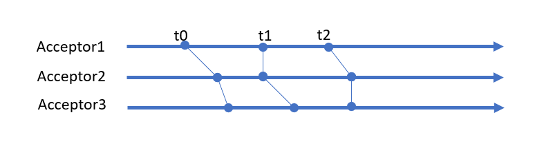
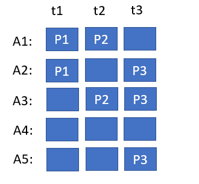
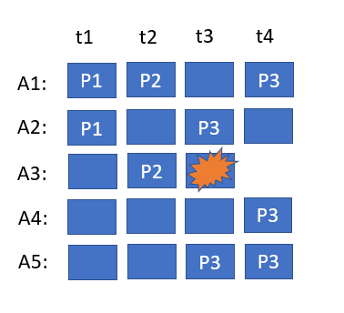
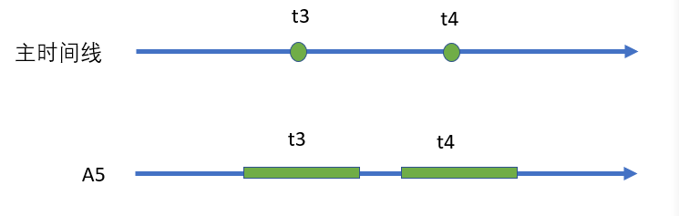
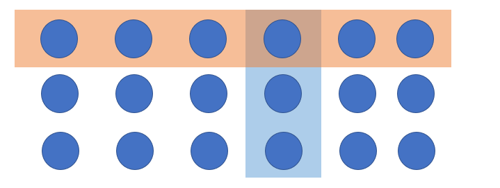

# Paxos' Research Report on Magic Law

The Paxos algorithm is not long, and only four short sentences are written on paper. The main reason why it looks like a book from heaven is that we don't know what the design intention behind these simple rules is, why it works, and whether it won't work without these rules? The background of distributed system is a chaos of free life and random death, and conflicts are everywhere, but Paxos algorithm has established a unified consensus world on this chaos, which seems like a miracle. However, it is very difficult for a mortal to understand miracles. He cannot stand at the height of God and overlook all living beings. He can only rely on his limited life experience to pursue and figure out God's intentions, which will inevitably lead to confusion belonging to mortals. This paper attempts to make an interpretation of Paxos algorithm from the perspective of interdimensional magic, and establish a concise magic image behind Paxos algorithm, so as to achieve our intuitive understanding of this algorithm.

##  One. The trouble of God

First, let's look at the problems facing God and where he may be troubled.

Suppose God needs a team of people to do the same thing collectively. The first problem he encountered was that everyone was unreliable. When you assign a task to A, he may not hear it at all because he is wandering outside, or he may be slow and dilly-dally, and the most excessive thing is to lie down in the middle and refuse to work. This problem is relatively easy to solve. It doesn't matter if a person is unreliable, as long as there are a few reliable people in a group. The advanced can drive the backward. God only needs to catch a few cadres at a time and guide them to do things well, and the rest of them can learn the oracle from the cadres.

The really tricky thing is that there's always a lot ** Parallel ** going on. God has just assigned work to A and is explaining it to B when A's situation changes again (such as receiving an oracle from another God). God can only run back to A and assign him a new oracle. A on this side has just been done, and B on the other side has a new moth, and God is in a hurry to arrive. After doing this several times, as a supreme, omniscient and omnipotent God, even if he has a good temper, he can't help having an attack.

## Two. Level 9 Magic: Time Stands Still

God is the most perfect being above all finite objects, so he does not really encounter the above troubles. Because, as long as he said softly: set, cast a nine-level magic "time still" can make this noisy world completely quiet, and then calmly do anything he wants to do.

According to our understanding of the modern physics of this plane, the so-called time is only a measure of change. We establish the concept of time by comparing the periodic motion of a pendulum with other motions. If no change is found, it actually means that the perceived time remains the same. In particular, if all the atoms in the universe oscillate slowly, the human beings in it will not be able to find it.

Looking back at the steps of the Paxos algorithm, the Proposer first determines a unique ProposalID from all Acceptors through the promise step, and then automatically increments the ProposalID when any event that needs to be identified occurs, such as receiving a new message. So ProposalID is actually some kind of time stamp. When the Acceptor receives the accept message, if it is found that the ProposalID has not changed compared with the previous promise, it can be determined that time remains static during this process. ** There are no incidents of concern. **.



Each Acceptor records a ProposalID that only increases and does not decrease, which is equivalent to establishing a local time arrow. The whole system is aligned to the same time point through ProposalID, which is equivalent to aligning multiple local time arrows and bundling them into a coarse-grained and holistic time arrow (** The precondition of alignment is that the events at the same time are exactly the same. ** for example, setting the same value). The passage of time is analogous to a wave front sweeping across the system.

So, from God's point of view, the Paxos algorithm is nothing more than a trick of time and ** Forcibly align multiple timelines to a single master timeline ** still magic.

This "stop-align" technique is a basic strategy for us to achieve consensus in distributed systems. For example, in a Kafka message queue, multiple consumers in the same consumer group act independently, but at the same time they must agree on how to allocate work. Therefore, when the number of members in the consumer group increases or decreases or the topic structure changes, the so-called Rebalance process will be triggered. In the rebalancing process, the Coordinator first asks all workers to stop their current work, collectively switch to the next epoch, and then issue a new allocation plan. An allocation scheme is valid only in one generation.

Optimistic locking, which we often use in databases, is the same strategy. Read the version number of the MainRecord when you first enter the handler, then modify the MainRecord and the associated SubRecord, and finally commit the modifications in a batch in a transaction while trying to change the version number of the master record.


```
  update MainRecord
  set version = version + 1
  where version = :record_version
```
If the update is successful, it means that time is static during the whole process, and no one else performs conflicting actions.

## Three. Level 8 Magic: Great Puppet

Casting 9th level magic is a very manic-consuming act. A God with socialist core values and thrift will never waste magic for no reason. So once time stands still, in order to maintain the consistent behavior of nodes in many places, God's best choice is to cast an eight-level magic "Great Puppet" to replicate the behavior of one node to all other nodes.

This kind of reproduction comes from the power of God, so once the leader launches a new action, it will cross thousands of mountains and rivers, ignoring the physical barrier and coming directly to the distant follower, who has no right to refute, only the freedom to execute. However, as the saying goes, move your mouth at the top and break your legs at the bottom. In our low magic world, it is not easy to implement the big puppet, which is usually achieved by adding a log file on the sending end and a log file on the receiving end.

The sender writes the action decision to the log, making it an immutable oracle. The sending component scans the log system to ensure that it is communicated to the remote end one by one. If the receiving end cannot be connected, or the sending is wrong, or the expected response information is not received after sending, the sending component cannot complain or give up, and can only work ** Keep retrying ** hard until a successful response is received. This process can ensure at least one successful sending (At Least Once). The receiving end must unconditionally receive all messages without rejection or tampering. Because it is possible to receive the same message multiple times, it must go through the local log ** Idempotent check ** to filter out all duplicate messages so that it can be processed successfully at most once (At Most Once). If the message needs to be relayed through a stream processing system (Stream), in order to avoid continuous replay from the source each time, the intermediate node needs to be able to ** Snapshot mechanism ** record the completed processing results.

There is no doubt that MultiPaxos and Raft algorithms are a concrete implementation of the above replication strategy. Once the master is selected successfully, the Term number representing the tenure can be reused for multiple times, and multiple execution instructions can be issued through the same Term number, as long as these instructions can be distinguished by the log index.

If we analyze it carefully, we will find that the messages received from the network can be divided into two categories: one is Request, the receiver can freely choose the corresponding processing method, the processing result is uncertain, and it can return successfully or throw an exception. The other is one-way Notice, whose corresponding processing method is fixed, and the receiver can not refute the opinions. i

An interesting example is two-phase commit. In the Prepare phase, the Participant receives the request message, so it can commit or rollback according to its own independent will. Once the Participant returns its possible choices to the Coordinator, it relinquishes its autonomy to the Coordinator, promising to only receive notification messages in the future and behave in line with the Coordinator. When the Coordinator decides to commit, the Participant never chooses to rollback. Similarly, if the Participant rolls back, we know that the Coordinator's choice can only be a rollback. Their choices are no longer made independently, but entangled.

If we look at each Participant and Coordinator separately, each may be in a commit or rollback state at random. But if we look at them as a whole, we will find that not all States are possible, only | commit, commit > and | rollback, rollback > are allowed States in the whole state space, that is to say, in the process of 2PC running, the whole system is actually in the state of | commit, commit > and | rollback, rollback > ** Quantum entangled state **!

Based on the above considerations, quantum entanglement is a feasible mechanism to realize puppetry in our plane.

## Four. The secret of magic: what is unseen is not there

As mortals, we don't have magic to drive magic. But we have all seen magic, and we have all experienced the so-called "moment of witnessing miracles". Miracles are born of magicians who lead us only to observe the revealed facts, and the secret of under the hood is not for outsiders. Magic, as an enhanced version of magic, is essentially a similar principle: just make sure that all facts that do not conform to the principles of magic are removed from our knowledge!

After the Paxos algorithm is running, we try to make time stand still, but the annoying interference information keeps appearing. Acceptor may receive messages from the past (ProposalID is less than the current value), and the solution of Paxos algorithm is ** Pretend not to see it and throw it away. **! On the other hand, the Acceptor may also receive messages from the future, and the simplest solution is still to throw them directly. However, in this case, a situation similar to a distributed lock will occur, resulting in insufficient fault tolerance: in this period of time quiescence, it is possible that the Proposer has hung up and cannot continue to complete the task of setting the value to the Acceptor. So in the face of the two choices of the present and the future, to be on the safe side, Acceptor can only give up what has been achieved in this cycle and choose the possibility of the future (magic failure is not shameful, pretend not to see it, and continue to the next round). Of course, if the Acceptor already knows through the Learner mechanism that the current value has been selected, there is no need to continue running the next round of the Paxos algorithm, and future requests can be rejected directly. Similarly, in the Raft protocol, in order to avoid the oscillation caused by the continuous re-election of the cluster, the RequestVote message from the future will be ruthlessly discarded as long as the Leader still exists through the heartbeat information within a certain period of time.

A classic problem in algorithms that require Leader elections is ** How to avoid a split brain **? What if the leader of the new generation has won the support of the people, but the leader of the old generation refuses to abdicate and keeps stirring up trouble? A general solution is: ** The old Leader is defined as a zombie, completely ignoring all information from the previous generation. ** (for example, reject all smaller epoch requests). In fact, we do not restrict the behavior of the old Leader, in its own small world, it can do whatever it wants, but its behavior ultimately can not rise to the collective will, can not have an impact on the main world. As soon as the new Leader succeeds, it needs to ** Write before read ** mark its own epoch in the main world (similar to changing the global shared variable). In this way, the old Leader finds that he has lost power through the optimistic lock when submitting the calculation results, and finally he has no choice but to give up his own processing results.

In the physics of our plane, with the development of quantum mechanics, observation or measurement has a very unique theoretical significance. According to the view described by quantum field theory, in the virtual time that we can't see, countless wild things are competing and annihilating with each other, and what is finally reflected in the real world is only the result of some kind of comprehensive operation. Through the strange quantum tunneling effect, we can actually see the stormy waves behind it.

Deceiving oneself is not a ridiculous joke, but a law that can really work in our world. If we can effectively create a cocoon of information that covers everything, it can manipulate the truth of the world we know. So, the king of understanding, a man who claims to be infinitely close to God, has been crazily hinting that without testing, COVID-19 does not exist! As a fire thief who reveals the secret of heaven, he really knows the king.

## Five. Mortal Consensus: Symmetry Breaking

God says all men are equal. To explain in mathematical language, everyone has no particularity, they are Symmetric! A society can not have only one voice, everyone can have their own opinions, each opinion deserves the same respect, then why is there a person's voice finally chosen, over all other people's voices, and eventually become the consensus of all people? In essence, this is ** The process of breaking equality ** what is mathematically called Symmetry Broken.

The most basic symmetry-breaking technique is majority voting. Because it is impossible to have two majorities in a set at the same time, as long as at any time (determined by ProposalID), we know that most Acceptors have accepted a certain value, we say that this value has become the chosen value, and consensus has been reached.

### When was the consensus reached?

When a consensus emerges, does any of the participants know that a consensus has been reached? An interesting fact is that at the moment when a consensus is reached, none of the participants in the system, including Acceptor and Proposer, knows that a consensus has been reached! However, as time goes on, the algorithm will ** The fact that a consensus has been reached is gradually revealed. ** run.



Consider the case of 5 Acceptors and multiple Proposers. At ProposalID = T1, proposal P1 is accepted by A1 and A2, but the majority is not reached, so the value is not determined in this round of processing. Proposal P2 with ProposalID = T2 also failed to reach a majority. Proposal P3 with ProposalID = T3 was accepted by the majority A2, A3, A4, resulting in a consensus.

First of all, we notice that before the consensus is reached, ** It is possible for an Acceptor to change the value it accepts ** for example, A3 accepts P2 first and then accepts P3. Because the Proposer may be lost at any time, the Acceptor can only choose to accept the new value. This makes it impossible for A3 to know that a consensus has been reached when it accepts P3, which is the final selected value. In the same way, A2 and A4 only know their own partial situation, and there is no way to judge whether the whole system has reached a consensus. On the Proposer side, before receiving the successful response from the majority Acceptor, it does not know whether the P3 submitted by itself can be accepted by the majority Acceptor, which becomes the final consensus. So say ** Consensus belongs to the whole, and individual participants need to have a process of understanding whether the consensus is reached. **.

### Can the consensus that has been reached be overturned?

In the example in the previous section, after reaching a consensus on ProposalID = T3, is it possible for us to reach a new consensus P4 at T4? In this case, the consensus at T3 is P3, the consensus at T4 is P4, and there is no consensus at T1 and T2. For God, it is completely OK to choose different values at different times. No Problem, because God is omniscient and omnipotent. But for blunt mortals, if different points of agreement are allowed at different times, he will appear ** Cognitive impairment **.

If the consensus is allowed to be overturned, how can a mortal with limited cognitive ability know which value is the value to be used? There are many times when there is no consensus at all (for example, T1 and T2). Should he go through all the times from T1 to TN to get the value of all the consensus?




Now, consider the situation in the diagram above. Suppose A3 goes down directly while processing P3. From the outside, there are two situations:

1. A3 has accepted P3, so there is a consensus.
2. A3 has not yet accepted P3, so no consensus has been reached

No one knows about its handling except A3 itself. However, A3 is dead, and it can't answer any questions! Therefore, if there may be different consensus at different moments, then we may fall into an embarrassing situation, that is, the historical results are completely in a state of quantum uncertainty, and can not simply answer yes or no.

For mortals, the ideal choice is for the system to have something ** Monotonicity ** that will only move in one direction, and once it reaches the goal state, it will remain in that state forever. In this way, any time we want to extract information from the system, we can directly push the system forward. If the system has reached a consensus, we will continue to get a consensus value, and if there is no consensus, we will actually choose a value, thus getting rid of the uncertain state. For example, in the above example, we continue to run the one-step Paxos algorithm, and no matter what choice A3 makes at T3, we will definitely get the result of P3 at T4, and thus after ** The uncertainty in the system is eliminated. ** T4. In Yu Bai's article, this is also called the maximum commit principle.

Note that we may have run the Paxos algorithm one more time, thus bringing the system from an uncertain state to a certain state. It's like a quantum system, you look at it, and its state collapses into an eigenstate. If it has been in an eigenstate before, the observation does not change the state of the system.

### If we ensure that the consensus remains unchanged?

Consensus is the knowledge that exists on the main timeline of the main world. According to the study of modern magic, the knowledge of two different points in the time line is completely independent! If we want to establish a relationship between these two points of knowledge, we must introduce some ** "Contact" ** mechanism so that information can be transmitted from one point of time to another.

First of all, we know that all the facts on the main timeline must be sorted according to the "time point" of occurrence, and the consensus is that the writing occurred at a certain time point in the main timeline. The easiest way to maintain consensus, then ** Read before writing **, is to take a peek at what's ahead before writing.



If you can sneak a look at the result of T3 when writing at T4, ** Use the result of T3 directly as the value written by T4 ** won't you be able to ensure consistency?

With the blessing of nine levels of magic, you can complete a complex of ** Atomic events ** reading, processing and writing at any point in the main timeline with only one thought. Events in the main timeline can be decomposed to correspond to events in the subordinate small world. Journey to the West once recorded: a day in heaven, a year on earth. So a point in the main world is mapped to an interval in the small world (if there is a local clock in the small world, it will find that start-process-end is a longer process, rather than a static point in time). This mapping preserves the atomicity and relative position of events. For example, in the above diagram, both T4 and T3 of A5 are not separable, and they do not cross. If T3 and T4 cross, something unexpected has happened in the interval of time stillness, which contradicts the assumption of time stillness. T4 must be behind T3 and not intersect T3, so it must see the result of T3.

The Paxos algorithm collects the accepted values on the majority Acceptor in the first phase.

1. ** If consensus has been reached, ** The first stage must return the value of this consensus, and it ** It must be the largest value of ProposalID. **. Prove that if a consensus is reached at time T3, then ** Be a close second ** T4 must have seen the result of T3, and according to the rules, its value must be the consensus value. So if the maximum value of ProposalID is not the consensus value, it means that no consensus could have been reached before it.

2. ** If consensus has not been reached ** The Proposer is free to choose the value he wants, so it is completely allowed for him ** Take the initiative to help others ** to choose the value with the largest ProposalID.

Perhaps some people will find it strange that Proposer submits other people's values, but what about his own values? Note that the purpose of the Paxos algorithm is ** Achieve consensus ** not to satisfy personal desires. ** Turn your value into a consensus **. In fact, when Proposer finds that his value cannot be submitted, he can give up the following work without affecting the correctness of the algorithm. His initiative to help others only accelerates the convergence process of the system. If a Proposer receives responses from all Acceptors, and after analysis, he finds that no consensus has been reached, he can choose not to support others and insist on submitting his own value. It is a human virtue to help each other. If you help others this time, maybe others will help you next time.

## Six. Certainty over uncertainty

In the eyes of mortals, the world is full of upsetting uncertainty, and every action produces three possible outcomes: ** 1. Success, 2. Failed 3. I don't know what the result is. **. Once upon a time, isolated stand-alone systems provided us with a utopian illusion that the world was dichotomous, good and bad, success and failure, light and darkness. But the real world is sobering, and in a world dominated by chance, this inherent uncertainty makes distributed systems inherently difficult.

In order to survive in an accidental and uncertain world, we have to cooperate sincerely and form a collective consciousness beyond the individual. Individuals can die, while collectives achieve immortality through metabolism. An interesting question is whether Majority is the only alternative to collective consciousness? Apparently not. The inheritance of spirit only needs the existence of seeds.

Consider an example of a Grid Quorum, 

For a Grid composed of the above `3*6` acceptors, we can stipulate that a consensus can be reached as long as ** Write to any column ** the Quorum is composed. Clearly, any two columns are disjoint. To avoid making contradictory choices, we need to build a bridge horizontally, stipulating that Paxos must read at least one row in the first phase of reading. Assuming that consensus has been born at some point, the next consensus must go through a row read and then a column write. Because any row and any column intersect, the row read must read the consensus value, so the new value written must be consistent with the previous consensus. Note that the row Quorum and the intersecting column Quorum in this example do not have a majority, and their total number of elements is 3 + 6-1 = 8, which does not constitute a majority. Therefore, the Quorum need not be the same or in the majority when reading and writing, as long as they intersect enough to pass information.

To transcend the individual, it is only necessary to sublimate the individual into a member of the Quorum. An individual can belong to multiple Quorum. As long as all Quorum in the past and in the future are in harmony and do not make conflicting choices, eventually we can form a unified collective will.

## Seven. The secret of time

For mortals, time is a magical transcendental existence. It seems that all our coordination work is essentially using the direction provided by the arrow of time. In our plane, Sir Isaac Newton was the first to discover that time divides cause and effect, with cause on the left and effect on the right, for which he wrote the great and immortal Law of Newton II.

>  F = m * A, factor = linear coefficient * fruit

Later, Einstein imagined emitting a photon to explore the world around him, inadvertently revealing a shocking secret: ** The timeline is not unique. **!

If the timeline is not unique, how can we avoid losing our way? One option is, ** Remember all the timelines. ** which forms the so-called ** Vector clock ** (Vector Clock) technique. And if we choose all ** Align the timeline ** to be the only one, it becomes ** Paxos algorithm **.

Do we have any other choice? Imagine how cool it would be if you could completely get rid of the shackles of cause and effect and travel freely on the timeline, regardless of the past or the future. The cause is on the left and the effect is on the right. Why can't it be reversed? Essentially, this is because the system does not satisfy the commutative law, and the same result cannot be obtained when the left and right sides are reversed. Only in a world of high demons, it doesn't matter left or right, it doesn't matter before or after, where the real ** Lv10 Magic: Reverse Cause and Effect ** can be displayed. What about CRDT data structure?

## Eight. Conclusion

The difference between man and God lies in the divine realm. In the divine realm, words follow the law. Making rules is the starting point of God, while humbly accepting rules and cunningly using them is the essence of human beings.

A handful of mortals, called programmers, who claim to be the false gods of the program world, always try to overstep this gap. But only by truly simulating God's behavior can people truly realize their own limitations and the greatness of God. Why can I receive a response when I send a message? Because all the servers are stored on the earth, the distance between them is limited. Why can the Lease duration be determined by the local clock? Because all the servers are stored on the earth, the gravitational field is similar, and the local clocks are comparable. Standing on the human scale, we can not imagine how to cross more than half of the galaxy to achieve consensus.

Finally, let us listen again to God's will:
* God said, "Let there be time."
* God said, Time stands still.
* God said, The world is wide.
* God said: Billions of Fen Shen
* God said: The torch is handed down from generation to generation.

